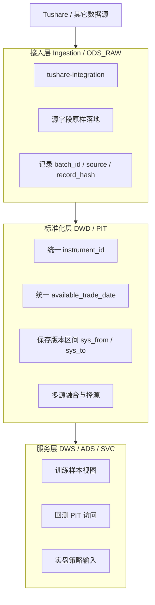

# 天级量化交易系统数据层设计方案

## 1. 文档背景

团队正在建设一个天级量化交易系统，我当前负责数据层建设。  
一期数据源以 Tushare 为主，当前已经确定：

- 先用 Tushare 数据
- 用 `tushare-integration` 将数据采集到 ClickHouse

本设计文档的核心目标，是在现有基础上回答三个问题：

1. 当前 `tushare-integration + ClickHouse` 的设计，是否满足 Point-in-Time（PIT）要求
2. 如果要支持统一、稳定、可追溯的 PIT 数据访问，应该在哪一层做
3. 面向模型训练、回测、实盘策略生成，数据层应该如何分层和落地

---

## 2. 建设目标

### 2.1 业务目标

数据层需要同时支撑以下三类消费场景：

- 模型训练
- 回测系统
- 实盘策略生成

### 2.2 工程目标

数据层必须满足以下要求：

- 多源数据接入
  - 一期以 Tushare 为主
  - 后续可接入其它数据源
- 天级更新
  - 收盘后尽快更新完成
  - 服务于当晚模型训练和第二天策略生成
- 提供统一、稳定、可追溯的 PIT 数据访问能力
- 支持数据分层
  - 原始数据层
  - 标准化数据层
  - 服务访问层

### 2.3 设计原则

- **源数据与业务语义解耦**：采集层负责“忠实落地”，标准化层负责“统一口径”
- **先可用、再完善**：一期优先覆盖天级核心链路，不一开始就追求全市场全字段全双时态
- **PIT 优先于方便查询**：对训练、回测和策略输入，宁可保守，不允许引入未来函数
- **可追溯优先于宽表便利**：任何训练集和策略输入，都要能追溯到来源记录、采集批次和数据版本

---

## 3. 当前现状与能力评估

## 3.1 当前技术方案

当前已落地的链路可以概括为：

```text
Tushare API
  -> tushare-integration Spider
  -> schema 驱动字段定义
  -> Pipeline 做空值填充/类型转换
  -> ClickHouse 单表落库
```

当前项目的主要特点：

- 每个 API 一张表
- 表结构由 YAML schema 驱动
- 每日增量更新由 spider 决定
- 有批次日志表 `tushare_integration_log`
- ClickHouse 侧主要使用 `ReplacingMergeTree` / 主键模型来承接“upsert”

## 3.2 当前方案的优点

- 已经具备较强的 **Tushare 接入能力**
- 股票、指数、期货接口覆盖较全
- schema 驱动，后续补接口和补字段成本较低
- 已具备基本的任务编排能力，适合日终批量更新
- ClickHouse 适合做天级因子、历史行情、训练样本的批量分析

## 3.3 当前方案存在的关键问题

从 PIT、可追溯、多源扩展的角度看，当前设计还不够。

### 3.3.1 当前是“最新值覆盖模型”，不是“历史版本模型”

当前 `TushareIntegrationDataPipeline` 的写入语义是：

- 有主键则去重后 upsert
- 无主键则 insert

这意味着：

- 同一业务主键的新数据会覆盖旧数据
- 对于会被后续修订的数据集，旧版本无法完整保留
- 无法回答“某天当时系统看到的版本是什么”

典型受影响的数据：

- 财务数据
- 分红送股
- 业绩预告/快报
- 股权质押、回购、股东人数等公告类/事件类数据

### 3.3.2 现有表缺少逐行可追溯元数据

当前虽然有批次日志表，但业务数据行本身通常不带：

- `source`
- `api_name`
- `batch_id`
- `ingest_time`
- `record_hash`
- `raw_payload`

因此无法准确回答：

- 某一行数据来自哪个源
- 是哪一次采集任务写入的
- 如果源数据后来变化，旧版本是什么

### 3.3.3 当前空值处理会损失真实语义

当前 pipeline 会把空值填成默认值：

- 数值填 `0`
- 字符串填 `""`
- 日期填 `1970-01-01` / `1971-01-01`

这个策略对“尽快落库”有帮助，但对建模和 PIT 不友好，因为：

- 无法区分“真实为 0”和“源数据缺失”
- 无法区分“真实日期”和“占位日期”
- 会污染因子计算和训练样本

### 3.3.4 ClickHouse 当前 latest/upsert 语义不够稳定

当前 ClickHouse 的“upsert”本质上还是 `INSERT`，依赖引擎的替换语义。  
如果没有显式版本列和严格查询约束，会有几个问题：

- 同一主键可能短时间内同时存在多个版本
- 合并前后查询结果可能不一致
- 对外提供“稳定最新视图”时，容易出现语义漂移

### 3.3.5 当前是源接口表，不是统一域模型

当前一张表基本对应一个 Tushare API。  
这对于采集是合理的，但对于后续多源融合和统一服务有问题：

- 字段命名受源系统影响
- 不同源之间没有统一 `instrument_id`
- 没有统一的“证券主数据 / 交易日历 / EOD 行情 / 财报事件 / 企业行为”抽象

### 3.3.6 当前没有正式的 PIT 访问层

现在更多是“落表后供人查”，而不是“受控的时间点访问能力”。  
这会直接影响：

- 模型训练是否有未来函数
- 回测是否能复现历史真实信息集
- 策略生成是否和训练/回测口径一致

---

## 4. 什么才算满足 PIT

在本项目里，PIT 不只是“按 trade_date 查历史数据”，而是：

> 在任意一个决策时点，系统只能看到当时已经可获得的数据版本，不能看到未来才发布或未来才修订的数据。

对于天级量化系统，建议采用 **交易日粒度的 PIT 定义**，即：

- 对于某个目标交易日 `T`
- 可用数据必须满足 `available_trade_date <= T`
- 如果要复现某次历史训练/回测，还要能识别该数据当时被哪个版本写入

也就是说，需要至少两类时间概念：

### 4.1 业务时间

- `trade_date`：行情归属交易日
- `ann_date`：公告日期
- `end_date`：财报报告期

### 4.2 可用时间

- `available_trade_date`：该条数据最早可以用于交易决策的交易日

对于天级系统，`available_trade_date` 比精确到秒的发布时间更重要。  
因为我们的消费场景是：

- 当晚训练
- 当晚生成 T+1 策略
- 回测复现 T+1 决策

### 4.3 系统时间

- `ingest_time`：数据实际入库时间
- `batch_id`：属于哪一批采集
- `sys_from` / `sys_to`：该版本在数仓里的生效区间

如果未来要做强可复现，必须保留系统时间。

---

## 5. 当前方案是否符合 PIT

结论：

> **当前 `tushare-integration -> ClickHouse` 可以作为采集与落地基础，但还不符合完整 PIT 设计。**

更准确地说：

- **对行情类快照数据**：部分满足“按交易日回看”
  - 例如 `daily`、`index_daily`、`fut_daily`
  - 因为它们天然按 `trade_date` 组织
- **对公告/财务/事件类数据**：不满足 PIT
  - 因为这些数据存在后续修订、补披露、重述、状态变化
  - 当前只保留最新状态，不能还原历史可见版本
- **对全系统统一访问能力**：不满足 PIT
  - 没有统一标准层
  - 没有统一可用日口径
  - 没有统一服务层

因此，当前系统不能直接作为最终的 PIT 服务层。

---

## 6. PIT 应该在哪一层做

这是本设计里最关键的问题。

### 6.1 方案 A：直接在当前 `tushare-integration` 上做完整 PIT

思路：

- 直接把当前每个 Tushare API 表改成 PIT 表
- 所有版本都在当前项目里管理
- 对外直接基于这些表提供查询

优点：

- 看起来改造路径最短
- 不需要马上再建设一层

缺点：

- 强耦合于 Tushare 源模型
- 后续多源融合非常困难
- 各类 API 的业务语义差异大，PIT 规则会分散在采集层
- 采集层会承担过多业务职责，不利于长期维护

结论：

> 不建议把“完整 PIT 能力”直接做在当前 `tushare-integration` 的源接口表上。

### 6.2 方案 B：把 `tushare-integration` 作为接入层，在标准化层做 PIT

思路：

- `tushare-integration` 负责“源数据接入 + 元数据补齐 + 原始/准原始落地”
- 在其上建设标准化数仓层，统一证券、日期、事件、财务、行情等口径
- PIT 语义在标准化层和服务层实现

优点：

- 能兼容未来多源
- PIT 规则集中管理
- 模型训练 / 回测 / 实盘可以统一口径
- 采集层和业务层边界清晰

缺点：

- 一期建设工作量比“直接落表就用”更大
- 需要补一层数仓加工逻辑

结论：

> **推荐方案：PIT 做在标准化层，当前 `tushare-integration` 只做接入层增强。**

这也是更符合工程长期演进的路线。

---

## 7. 推荐总体架构

推荐的数据架构如下：



---

## 8. 推荐分层设计

## 8.1 ODS 原始数据层

定位：

- 忠实保存源数据
- 支持追溯、审计、重放
- 不承载复杂业务语义

建议分成两类表：

### 8.1.1 ODS_RAW_SOURCE

保存源系统原始记录，建议追加写，不做覆盖。

字段建议：

- 源业务字段原样保留
- `_source`：如 `tushare`
- `_dataset`：如 `stock_daily`
- `_api_name`
- `_batch_id`
- `_ingest_time`
- `_record_hash`
- `_raw_json`

建议用途：

- 源数据追溯
- 重放下游处理
- 调试源数据质量问题

### 8.1.2 ODS_NATIVE_LATEST

保存源语义下的“最新快照”，便于运维和快速查询。

例如：

- `ods_tushare_stock_daily_latest`
- `ods_tushare_fina_indicator_latest`

这层可以沿用当前 `tushare-integration` 的 schema 化建表思路，但建议补齐元数据列。

## 8.2 DWD 标准化 PIT 层

定位：

- 构建统一业务模型
- 定义 PIT 规则
- 为训练、回测、实盘提供统一数据基座

建议优先建设的主题域：

- 证券主数据
  - 股票
  - 指数
  - 期货
- 交易日历
- 日线行情
- 复权因子
- 每日指标
- 财务指标
- 利润表/资产负债表/现金流
- 企业行为
  - 分红
  - 回购
  - 股东人数
  - 质押

### 8.2.1 统一主键建议

建议建立统一证券标识：

- `instrument_id`
- `instrument_type`
- `exchange`
- `source_code`

不要在服务层直接依赖不同源的原始 `ts_code`。

### 8.2.2 统一时间字段建议

标准化 PIT 表建议至少包含：

- `event_date`
- `available_trade_date`
- `sys_from`
- `sys_to`
- `source`
- `source_batch_id`

含义如下：

- `event_date`：业务归属日期
- `available_trade_date`：最早可被策略/训练使用的交易日
- `sys_from`：数仓版本开始时间
- `sys_to`：数仓版本结束时间

### 8.2.3 对天级量化系统的简化建议

一期不必一步到位做秒级双时态。  
建议先做 **交易日级 PIT**：

- 训练/回测/策略统一按 `available_trade_date` 控制可见性
- 系统追溯通过 `batch_id + ingest_time` 保留

这样实现复杂度显著降低，但已能满足天级系统的核心需求。

### 8.2.4 当 ODS 直接落在 ClickHouse 时，DWD 如何生成

这部分需要单独说明，因为当前已经决定：

- `tushare-integration` 采集后直接写入 ClickHouse
- 一期不引入额外的大数据计算引擎

在这个前提下，DWD 的生成本质上有三种实现方式。

#### 方案 1：基于 ClickHouse Materialized View 实时生成 DWD

思路：

- ODS 表写入后
- 通过 ClickHouse 的 Materialized View 自动把数据投递到 DWD 表

适用场景：

- 单表到单表的简单映射
- 几乎不需要复杂 join
- 几乎不需要回刷历史分区

优点：

- 实时性好
- 技术上看起来简单
- 不需要单独调度 SQL 任务

缺点：

- 不适合多表 join
- 不适合复杂 PIT 规则
- 不适合修订/回补/重跑
- 一旦标准化逻辑变复杂，MV 会迅速失控
- 对“重算某个交易日/某个公告日”的支持较差

结论：

> 不推荐作为当前 DWD 主方案。  
> 可以用于非常简单的辅助宽表或统计表，但不适合承担核心 PIT DWD。

#### 方案 2：基于 ClickHouse 内部批处理 SQL 生成 DWD

思路：

- ODS 仍然保存在 ClickHouse
- 日终由调度系统按主题触发 `INSERT ... SELECT ...` / `REPLACE PARTITION`
- 在 ClickHouse 内部直接完成标准化、join、去重、PIT 字段计算

典型链路：

```text
ODS_RAW / ODS_LATEST
  -> 临时表或中间表
  -> DWD 分区重算
  -> 服务层视图/快照
```

适用场景：

- 天级批处理
- 收盘后统一生成 DWD
- 需要支持重跑、补数、分区回刷

优点：

- 架构简单，不引入额外引擎
- 计算和存储都在 ClickHouse 内，吞吐高
- 非常适合天级批任务
- 支持按交易日/公告日做分区重算
- 工程上容易控制依赖、批次、回滚和重跑

缺点：

- 不是实时流式
- SQL 编排需要自己管理
- 当模型和逻辑特别复杂时，可维护性不如专门的数据建模工具

结论：

> **推荐作为当前阶段的主方案。**

#### 方案 3：引入外部计算层生成 DWD

思路：

- ODS 在 ClickHouse
- DWD 加工由外部引擎负责，比如 Spark / Flink / dbt / 自研 Python ETL
- 结果再回写 ClickHouse

优点：

- 转换逻辑表达力强
- 更适合超复杂建模和多步血缘管理
- 更容易做统一测试框架

缺点：

- 基础设施更重
- 运维复杂度明显提升
- 一期系统会过度设计
- 对当前“天级、收盘后批处理”的需求来说收益不高

结论：

> 当前阶段不建议上。  
> 可以作为未来多源、多资产、复杂特征工程阶段的扩展方向。

### 8.2.5 方案对比与推荐

| 方案 | 核心思路 | 实现复杂度 | 性能 | 重跑/补数 | PIT 适配度 | 当前建议 |
|---|---|---|---|---|---|---|
| 方案 1 | ClickHouse Materialized View | 低 | 高 | 弱 | 弱 | 不推荐做主方案 |
| 方案 2 | ClickHouse 内批处理 SQL | 低到中 | 高 | 强 | 强 | 推荐 |
| 方案 3 | 外部 ETL / Spark / Flink / dbt | 中到高 | 中到高 | 强 | 强 | 暂不采用 |

最终建议：

> **采用“ClickHouse 内批处理 SQL + 调度编排 + 分区重算”的方式，从 ODS 生成 DWD。**

原因很直接：

- 最符合当前已经落定的技术栈
- 对天级量化场景已经足够
- 不额外引入大计算框架
- 性能和工程复杂度的平衡最好

### 8.2.6 推荐的具体落地方式

推荐采用下面这套模式：

#### 模式：`ODS -> DWD_TMP -> DWD正式表`

每个主题域都按“受影响分区重算”的方式执行：

1. 识别受影响分区
   - 行情类按 `trade_date`
   - 财务/事件类按 `available_trade_date` 或 `ann_date`
2. 从 ODS 表抽取本次需要重算的数据
3. 在临时表中完成标准化、join、去重、PIT 字段计算
4. 用分区替换或分区覆盖的方式写入正式 DWD
5. 记录本次 DWD 任务的 `batch_id`、影响分区、行数、状态

这样做的好处：

- 不会因为整表重算影响日终窗口
- 失败时可以按分区重试
- 对训练、回测和实盘的口径最稳定

#### DWD 表建议的分区方式

建议优先按 `available_trade_date` 或核心业务日期分区：

- 行情类：按 `trade_date`
- 财务/公告类：按 `available_trade_date`
- 成分类/基础资料类：按 `effective_date` 或 `available_trade_date`

原因：

- 上层大多数查询都围绕“某个决策交易日能看到什么”
- 分区重算时也更自然

#### DWD 表建议的主键方式

以 PIT 表为例，建议主键至少覆盖：

- `instrument_id`
- `event_date`
- `source`
- `sys_from` 或 `version_ts`

如果一期先做交易日级 PIT，也可以简化为：

- `instrument_id`
- `event_date`
- `available_trade_date`

#### 推荐 SQL 组织方式

建议每个主题域维护独立 SQL：

- `sql/dwd/security_master.sql`
- `sql/dwd/stock_eod_price.sql`
- `sql/dwd/stock_financial_indicator.sql`

执行方式由调度器统一控制，而不是把 DWD 逻辑写回 `tushare-integration` 的 spider。

#### 推荐调度方式

建议把 DWD 加工设计成独立批任务：

```text
run_ods_ingestion
  -> check_ods_quality
  -> build_dwd_base
  -> build_dwd_standard
  -> build_service_snapshot
```

这样有几个好处：

- 采集失败和数仓加工失败可以分开处理
- 可以单独重跑 DWD，不必重跑采集
- 后续接入其它数据源时，DWD 逻辑可以复用

### 8.2.7 一个简单高效的推荐实现

如果按“当前阶段简单高效”来选，我建议：

> **ODS 放 ClickHouse，DWD 也放 ClickHouse；  
> 用调度系统触发 ClickHouse SQL 批处理；  
> 按分区重算，不做全量重刷；  
> 通过临时表 + 正式表替换完成发布。**

具体可以落成：

- ODS：
  - `ods_tushare_xxx_raw`
  - `ods_tushare_xxx_latest`
- DWD：
  - `dwd_xxx_tmp`
  - `dwd_xxx`
- 服务层：
  - `svc_xxx_snapshot`

示意流程：

```text
Step 1: tushare-integration 写入 ods_tushare_*_raw / latest
Step 2: 调度器识别本批次影响的 trade_date / ann_date
Step 3: ClickHouse SQL 生成 dwd_*_tmp
Step 4: 用分区替换写入 dwd_*
Step 5: 基于 dwd_* 生成 svc_* 快照
```

推荐理由：

- 简单：不新增 Spark/Flink
- 高效：计算在 ClickHouse 本地完成
- 稳定：天级任务天然适合批处理
- 可回放：可以按批次和分区重跑
- 易扩展：后续其它源进入 ODS 后仍然能复用 DWD 逻辑

## 8.3 服务访问层

定位：

- 不让上层模块直接拼底层表
- 提供稳定、统一、可复用的数据访问入口

建议至少提供三类能力：

### 8.3.1 训练数据访问

例如：

- 特征快照视图
- 标签对齐视图
- 训练区间样本提取

### 8.3.2 回测 PIT 访问

例如：

- 给定 `as_of_trade_date`
- 输出该日可见的全量因子/基础信息/事件信息

### 8.3.3 实盘策略输入

例如：

- 给定 `decision_trade_date = T+1`
- 返回截至 `T` 收盘可见的数据快照

---

## 9. 推荐的 PIT 口径

## 9.1 总原则

> 上层任何模块都不直接按“自然日最新值”取数，而是按“某个决策交易日可见版本”取数。

## 9.2 各类数据的 available_trade_date 规则

### 9.2.1 行情类

适用范围：

- 日线
- 指数日线
- 期货日线
- 每日指标
- 复权因子

规则建议：

- `event_date = trade_date`
- `available_trade_date = next_trade_date(trade_date)`

原因：

- 我们服务的是 T+1 策略生成
- 用 T 收盘后的数据生成 T+1 决策最稳妥

### 9.2.2 公告/财务/事件类

适用范围：

- 财务报表
- 财务指标
- 分红
- 回购
- 股东人数
- 质押

规则建议：

- 优先使用官方公告日期 `ann_date`
- `available_trade_date = next_trade_date(ann_date)`

原因：

- 多数数据源没有稳定可靠的分钟级发布时间
- 用 `ann_date` 当天直接可用存在未来函数风险
- 对天级系统，统一按“下一交易日可用”是更保守、更可复现的规则

### 9.2.3 成分/分类/基础资料类

适用范围：

- 股票列表
- 指数成分
- 行业分类
- 基础信息

规则建议：

- 如果有明确生效日期，用生效日期
- 如果只有公告日期，用 `next_trade_date(ann_date)`
- 如果只有采集日，则暂用 `next_trade_date(ingest_date)`，后续逐步细化

---

## 10. 对当前 `tushare-integration` 的改造建议

结论先说：

> 当前项目不建议直接承担完整 PIT 服务职责，但必须做“接入层增强”，否则后续标准化层无法稳定落地。

## 10.1 必做改造

### 10.1.1 增加逐行元数据列

建议给采集落表统一补充以下列：

- `_source`
- `_api_name`
- `_batch_id`
- `_ingest_time`
- `_run_id`
- `_record_hash`

价值：

- 行级可追溯
- 便于去重
- 便于问题排查
- 支撑下游版本构建

### 10.1.2 支持 append-only raw 落地模式

当前主要是 upsert/latest 语义。  
建议新增一种写入模式：

- `append_raw`

即：

- 原始层只追加，不覆盖
- 最新快照层再单独维护

### 10.1.3 原始层保留空值，不做默认值污染

当前 fillna 对原始层不合适。  
建议调整为：

- **ODS_RAW**：保留空值
- **ODS_NATIVE_LATEST / DWD**：按业务规则处理空值
- **特征层**：按模型需要做缺失值填充

### 10.1.4 ClickHouse latest 表增加显式版本列

对于需要 latest 语义的表，建议至少增加：

- `_version_ts` 或 `_ingest_time`

避免完全依赖无版本的替换语义。

## 10.2 建议改造

### 10.2.1 保留 raw_payload

对复杂事件类接口，建议保留一份 `_raw_json`。  
这对追溯问题非常有价值。

### 10.2.2 统一命名与配置

当前很多表名仍直接等于 API 名。  
建议后续逐步形成：

- `ods_tushare_xxx_raw`
- `ods_tushare_xxx_latest`
- `dwd_xxx`
- `svc_xxx_snapshot`

这样更利于多源扩展和治理。

---

## 11. 推荐的落地方案

## 11.1 一期推荐路线

### 路线结论

> `tushare-integration` 继续保留，作为 **数据接入层**；  
> PIT 不直接做在当前源接口表上，而是在 **标准化层** 建设。

### 这样做的原因

- 兼容未来多源
- 避免把 Tushare 字段语义绑死在服务层
- 避免采集项目承载过多业务逻辑
- 让训练、回测、实盘统一走同一套数据协议

## 11.2 建议的表层落地

### 层 1：ODS

- `ods_tushare_*_raw`
- `ods_tushare_*_latest`

### 层 2：DWD 标准层

优先做：

- `dwd_security_master`
- `dwd_trade_calendar`
- `dwd_stock_eod_price`
- `dwd_stock_daily_basic`
- `dwd_stock_adj_factor`
- `dwd_stock_financial_indicator`
- `dwd_stock_income`
- `dwd_stock_balance_sheet`
- `dwd_stock_cashflow`
- `dwd_index_eod_price`
- `dwd_future_eod_price`

二期再补：

- `dwd_stock_corporate_action`

### 层 3：SVC / ADS

- `svc_model_feature_snapshot_daily`
- `svc_backtest_feature_snapshot_daily`
- `svc_live_strategy_input_daily`

---

## 12. 一个可实现的数据流

```text
16:00-18:30  tushare-integration 采集收盘后数据，写入 ODS_RAW / ODS_LATEST
18:30-19:00  数据质量校验、缺失检查、批次登记
19:00-20:00  DWD 标准化加工，生成 PIT 表
20:00-20:30  生成特征快照 / 回测快照 / 实盘输入快照
20:30-21:00  模型训练、策略生成
```

如果某批次失败，必须做到：

- 当日批次状态可见
- 失败原因可追溯
- 可按 `batch_id` 重新跑当日流程

---

## 13. 在无法全量拉取时如何发现变更

这是落地时必须正面处理的问题。

现实约束是：

- Tushare API 有频率限制
- 很多接口不提供标准 CDC
- 大量接口没有稳定的 `updated_at`
- 日终窗口有限，模型训练和第二天推理还要抢时间

因此不能采用“每天全量重拉所有表”的策略。  
但也不能因为不全量，就默认“历史不会变化”。

### 13.1 基本判断

需要先明确一个事实：

> 在上游没有提供 `updated_at`、版本号、CDC 日志的情况下，不可能在“不重拉数据”的前提下 100% 精确知道是否发生了历史变更。

所以工程上不能追求“完美变更检测”，而要采用：

- 分表型增量
- 热窗口回补
- 本地哈希比对
- 低频兜底重扫

也就是说：

> 不是“完全知道哪里变了再去拉”，而是“基于业务特征，有策略地重拉最可能变化的范围，然后在本地识别变化”。

### 13.2 变更发现的总体策略

建议采用四层策略：

1. 表分型
2. 热窗口回补
3. 哈希比对
4. 低频兜底全扫

### 13.3 表分型策略

不要给所有表一套统一策略。  
建议至少分成四类。

#### A 类：交易日快照型

典型表：

- 股票/指数/期货日线
- 日频资金流
- 龙虎榜
- 大宗交易
- 涨停专题

策略：

- 只拉新的 `trade_date`
- 同时回补最近 `3~10` 个交易日
- 对相同业务主键做本地哈希比对

原因：

- 这类数据主要按交易日生成
- 绝大部分变更集中在最近几天
- 回补窗口不需要很大

#### B 类：公告/财务/事件型

典型表：

- 三大财务报表
- 财务指标
- 业绩预告/快报
- 分红
- 回购
- 质押
- 股东人数
- 股东增减持

策略：

- 不按全历史重拉
- 每天按 `ann_date` 或公告窗口回扫最近 `90~365` 天
- 月度或季度再做一次更长窗口重扫
- 同样通过哈希识别是否修订

原因：

- 这类数据最容易补发、修订、状态变化
- 只拉“今天新增公告”是不够的

#### C 类：主数据/名单/成员关系型

典型表：

- `stock_basic`
- `stock_company`
- `index_basic`
- `hs_const`
- `index_member`
- `ths_member`
- `concept_detail`

策略：

- 日常只扫描近期可能变动的范围
- 周度或月度全量刷新
- 如果有 `in_date/out_date/list_date/delist_date`，优先扫描这些边界附近的数据

原因：

- 更新频率相对低
- 但一旦变更，对策略 universe、回测口径影响很大

#### D 类：小表/字典表

典型表：

- `trade_cal`
- `concept`
- `index_classify`
- `hm_list`

策略：

- 直接全量刷新

原因：

- 数据量小
- 做复杂增量没有意义

### 13.4 热窗口回补机制

热窗口回补是当前阶段最重要的变更发现手段。

建议每张表都配置两个窗口：

- `new_window`
- `repair_window`

例如：

- 行情类：只拉当日新交易日，再回补最近 `5` 个交易日
- 资金流/榜单类：回补最近 `5~10` 个交易日
- 财务/公告类：回补最近 `90~180` 天
- 主数据类：回补最近 `30` 天，外加周度全量

这样即使我们事先不知道上游改了哪一天，也能通过热窗口把高概率变更覆盖住。

### 13.5 本地哈希比对机制

由于上游不提供可靠变更标记，建议在 ODS 层自己做版本识别。

每张 ODS 表建议增加：

- `_batch_id`
- `_ingest_time`
- `_record_hash`

`_record_hash` 的计算方式：

- 对业务字段按固定顺序拼接
- 计算 `md5` 或 `sha1`

这样重拉同一主键后可以判断：

- 主键相同、哈希相同：无变化
- 主键相同、哈希不同：源数据发生修订
- 主键不存在：新增

这是后续 DWD 构建 PIT 版本的基础。

### 13.6 低频兜底全扫

热窗口也不是万能的。  
有些接口会晚很久修历史，或者源侧补数并不稳定。

因此建议再加一层低频兜底任务：

- 周度全扫：主数据、成分、名单关系类
- 月度全扫：财务、事件重点表
- 季度全扫：三大报表、财务指标
- 小表：直接日度全量

这些任务不应该阻塞日终主链路，可以安排在：

- 深夜
- 周末
- 非交易时段

### 13.7 推荐的当前实现

如果按“简单高效、适合当前阶段”的标准选择，建议直接采用：

> 日终主链路 + 日终修复链路 + 低频兜底链路

#### 日终主链路

目标：

- 在收盘后尽快产出第二天训练和推理所需数据

执行内容：

1. 先跑 A 类交易日快照表
2. 再跑对第二天决策影响最大的 B 类热窗口表
3. 生成 DWD 和服务快照
4. 触发模型训练和策略生成

#### 日终修复链路

目标：

- 不阻塞主链路的情况下修复最近历史窗口

执行内容：

1. 回补最近 `N` 日热窗口
2. 做哈希比对
3. 如果发现变化，则更新 DWD 版本

#### 低频兜底链路

目标：

- 防止热窗口之外的迟到修订被永久漏掉

执行内容：

- 周/月/季频错峰全扫

### 13.8 推荐的表级配置方式

建议把变更发现策略做成配置，而不是散落在 spider 代码里。

示例：

```yaml
table: daily
change_detection:
  mode: trade_date_incremental
  repair_window_days: 5
  full_refresh_cron: "0 3 * * 0"
```

```yaml
table: fina_indicator
change_detection:
  mode: ann_date_rolling
  repair_window_days: 180
  full_refresh_cron: "0 4 1 * *"
```

```yaml
table: stock_basic
change_detection:
  mode: low_freq_full_refresh
  repair_window_days: 30
  full_refresh_cron: "0 2 * * 0"
```

### 13.9 与 PIT 的关系

这里要特别说明：

> 不每天全量拉全表，并不妨碍做 PIT。  
> 真正影响 PIT 的，不是“是否全量拉”，而是“是否把变更版本识别并保留下来”。

只要做到：

- 对可能变更的范围进行策略性重拉
- 用哈希识别修订
- 不覆盖旧版本，而是保留新版本
- 在 DWD 层按 `available_trade_date + version` 组织

那么就可以在非全量拉取的前提下建立可用的 PIT 体系。

### 13.10 本节结论

当前阶段最推荐的方案是：

- 小表直接全量
- 交易日快照表按新日期增量 + 最近 `5` 天回补
- 财务/公告/事件表按 `ann_date` 热窗口回扫 + 周/月兜底
- 所有回补结果做 `_record_hash` 比对
- 发现变化时生成新版本，不覆盖旧版本
- 日终主链路只跑“第二天必须用到”的表，其余放入修复链路

这套方案在 API 限速、日终窗口有限的前提下，兼顾了：

- 速度
- 准确性
- 可追溯性
- PIT 可落地性

---

## 14. 查询语义建议

## 14.1 训练/回测统一查询规则

对于目标交易日 `T`，查询条件必须满足：

- `available_trade_date <= T`
- 若启用系统版本回放，再加：
  - `sys_from <= replay_ts < sys_to`

## 14.2 实盘策略输入规则

对于 `T+1` 的盘前策略生成：

- 使用 `T` 收盘后更新完成的数据
- 对外暴露时可直接使用 `decision_trade_date = T+1`

即服务层可以统一给上层暴露：

- `decision_trade_date`
- `instrument_id`
- 训练/回测/实盘一致口径的特征快照

---

## 15. 数据质量与治理要求

建议把数据质量检查作为正式步骤，而不是附属逻辑。

## 15.1 必做检查

- 完整性
  - 预期交易日是否到齐
  - 关键接口是否更新
- 主键唯一性
  - ODS latest
  - DWD 当前版本
- 时效性
  - 收盘后多久完成更新
- 空值率
  - 关键字段缺失是否异常
- 分布变化
  - 与前一日相比是否明显异常

## 15.2 建议记录的批次指标

- `batch_id`
- `source`
- `dataset`
- `extract_start_time`
- `extract_end_time`
- `row_count_raw`
- `row_count_latest`
- `row_count_dwd`
- `quality_status`
- `quality_message`

---

## 16. 分阶段实施建议

## 阶段 1：补齐接入层可追溯能力

目标：

- 不推翻当前 `tushare-integration`
- 先把它从“能采”升级成“可追溯采集”

交付物：

- ODS raw/latest 双表策略
- 元数据列补齐
- batch/run 管理增强
- 原始层空值保真

## 阶段 2：建设核心 DWD 主题

优先顺序建议：

1. 交易日历 / 证券主数据
2. 股票日线 / 指数日线 / 期货日线
3. 每日指标 / 复权因子
4. 财务指标 / 三大报表
5. 企业行为事件

交付物：

- 核心 PIT 表
- `available_trade_date` 规则固化
- 数据校验规则

## 阶段 3：建设统一服务访问层

交付物：

- 训练快照视图
- 回测 PIT 查询视图
- 实盘策略输入视图
- Python SDK / SQL 访问规范

## 阶段 4：扩展多源数据

交付物：

- 新数据源接入规范
- source priority / source merge 规则
- 字段级血缘与来源标记

---

## 17. 方案对比与最终建议

| 方案 | 描述 | 优点 | 缺点 | 是否推荐 |
|---|---|---|---|---|
| 方案 A | 直接在当前 `tushare-integration` 源表上做完整 PIT | 改造路径短 | 强耦合 Tushare，不利于多源和长期治理 | 不推荐 |
| 方案 B | `tushare-integration` 做接入层增强，PIT 在标准化层建设 | 架构清晰，支持多源，口径统一 | 一期工作量更大 | 推荐 |

最终建议：

> **采用方案 B。**

即：

- 保留 `tushare-integration`，但重新定义其职责为 **接入层 / ODS 构建器**
- 不把它直接当最终 PIT 服务层
- 在其上建设标准化 PIT 层和服务访问层

---

## 18. 给团队的明确结论

### 17.1 可以继续沿用当前决定

- 一期继续以 Tushare 为主
- 继续使用 `tushare-integration` 采集到 ClickHouse

### 17.2 但需要明确边界

当前这套方案：

- **可以作为接入基础**
- **不能直接作为最终 PIT 能力**

### 17.3 PIT 的正确落点

PIT 应该建设在：

- **标准化数据层（DWD）**
- **并通过服务访问层对外提供**

### 17.4 当前项目需要承担的改造

`tushare-integration` 需要补齐：

- 原始层追加写能力
- 行级元数据
- 空值保真
- latest 版本控制

这样后续无论是训练、回测还是实盘，都能统一建立在同一套可追溯、可复现、无未来函数的数据底座上。

---

## 19. 后续建议的第一批任务清单

建议下一步直接立项拆成以下任务：

1. 改造 `tushare-integration`，支持 raw/latest 双落地
2. 给所有落表补齐 `_source/_api_name/_batch_id/_ingest_time/_record_hash`
3. 取消原始层默认值填充，保留空值
4. 设计 `dwd_trade_calendar`、`dwd_security_master`
5. 设计 `dwd_stock_eod_price`、`dwd_stock_daily_basic`
6. 设计 `available_trade_date` 统一规则
7. 建立 `svc_backtest_feature_snapshot_daily`
8. 建立日终批次质量检查和 SLA 监控

如果以上 8 项完成，数据层就能从“数据采集工具”进化为“量化系统可复用的数据底座”。
